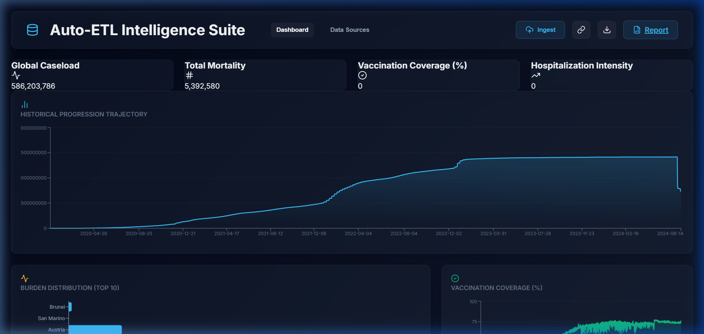
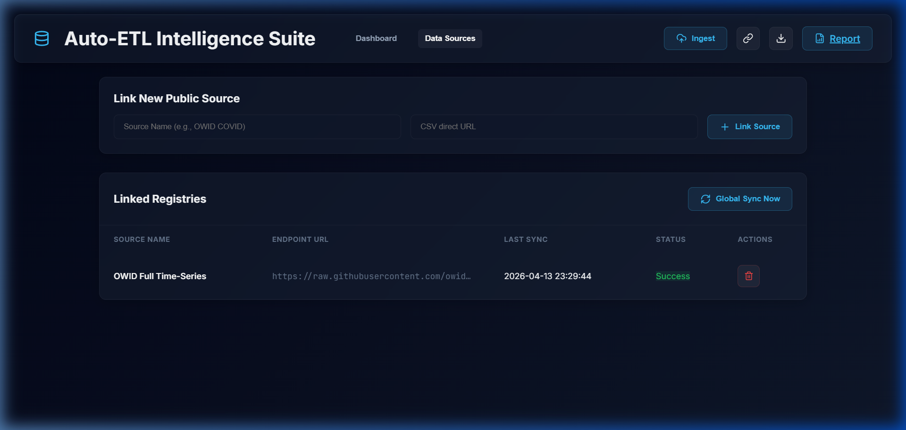
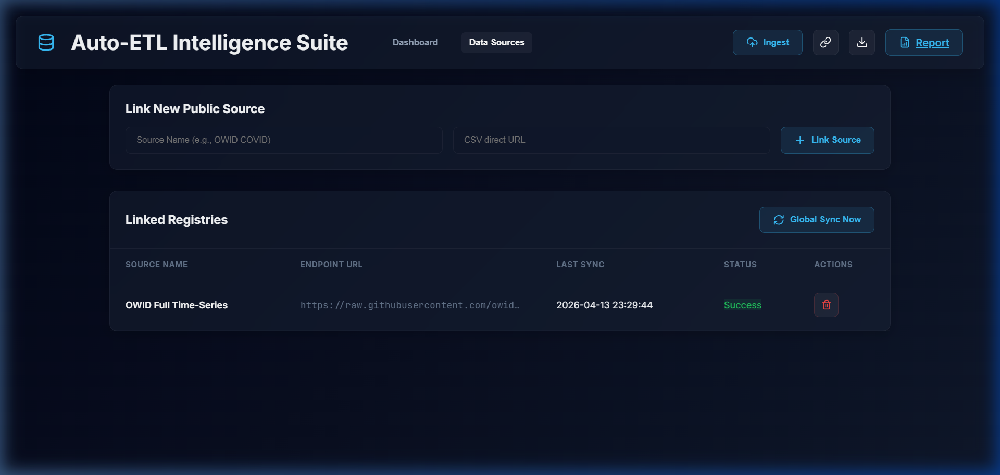
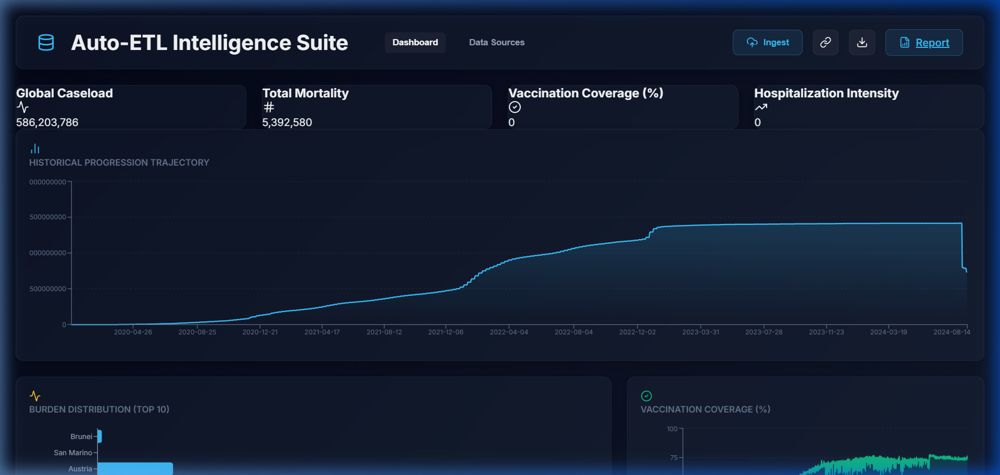
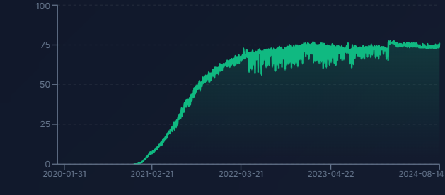
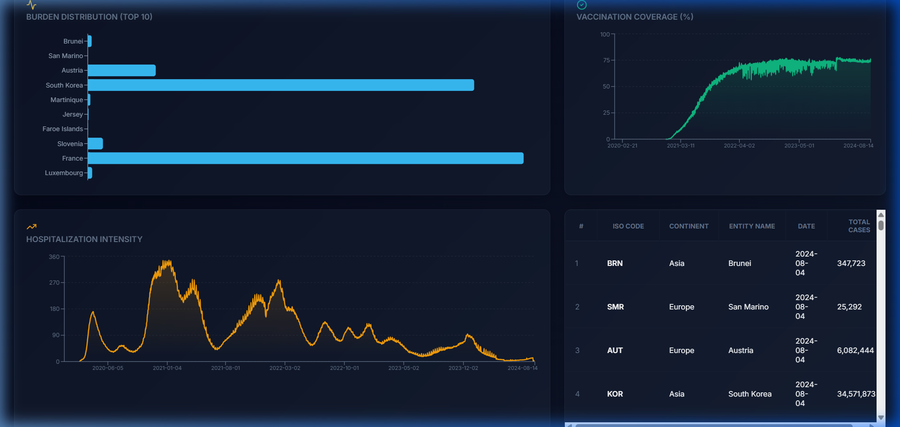

# Medical Intelligence Analytics Suite

Professional-grade epidemiological data ingestion, clinical auditing, and real-time visualization platform. This suite transforms raw public health data into actionable intelligence through automated integrity verification and high-fidelity reporting.

## 🏥 Clinical Intelligence Dashboard

### System Overview

*Mission Control: Real-time trends, validated KPIs, and global progression vectors.*

### Ingest & Integrity Reporting

*One-click synchronization with public clinical registries and automated PDF Integrity Briefing generation.*

### Multi-Registry Management

*Manage and synchronize multiple clinical endpoints for comparative analysis.*

## 📈 Clinical Visualization Gallery

The Mission Control dashboard provides a multi-dimensional view of the pandemic's trajectory through high-fidelity graphics.

### 1. Historical Progression Trajectory

*Visualizes the global cumulative caseload over time, audited for clinical consistency.*

### 2. Burden Distribution (Top 10)

*Identifies top-contributing regions by total volume to prioritize resource allocation.*

### 3. Vaccination Coverage (%)

*Monitors global population protection levels through normalized coverage tracking.*

### 4. Hospitalization Intensity

*Tracks the strain on clinical infrastructure via daily inpatient census metrics.*

## 🛠️ Technology Stack

- **Intelligence Engine (Python)**:
  - **Pandas & SciPy**: Advanced statistical cleaning, Monotonicity Enforcement, and MAD-based outlier redistribution.
  - **FastAPI**: High-performance REST API serving clinical snapshots and time-series data.
  - **FPDF2**: Automated generation of professional clinical integrity briefings (PDF).
- **Mission Control (React)**:
  - **Vite & Recharts**: High-fidelity responsive visualization of progression vectors.
  - **Lucide React**: Expressive clinical iconography.
  - **Vanilla CSS**: Premium glassmorphism-inspired clinical interface.

## 📊 KPI Dictionary & Logic

| KPI Name | Clinical Meaning | Mathematical Logic |
| :--- | :--- | :--- |
| **Global Caseload** | Total validated infections | Cumulative Sum (Repaired for Monotonicity) |
| **Total Mortality** | Verified clinical fatalities | Cumulative Sum (Audit-verified) |
| **Vaccination Coverage (%)** | Population protection level | Global Mean of Normalized Coverage (%) |
| **Hospitalization Intensity** | Clinical occupancy load | Global Mean of Patients per Million |

## 🚀 Getting Started

### Prerequisites
* Python 3.10+ & Node.js 18+

### Quick Launch (Windows)
1. Initialize the environment:
   ```powershell
   python -m venv venv
   .\venv\Scripts\activate
   pip install -r requirements.txt
   cd frontend && npm install && cd ..
   ```
2. Start the suite:
   ```powershell
   .\run_dashboard.bat
   ```

### Operational Pipeline
Use `.\RUN_PIPELINE.bat` to execute a full data cycle:
1. **Ingest**: Download latest data from OWID/Public sources.
2. **Clean**: Apply Monotonicity and MAD-based redistribution.
3. **Audit**: Execute clinical quality assurance checks.
4. **Report**: Synchronize dashboard and generate **Integrity Briefing PDF**.

---
*Developed for the Medical Intelligence Unit - Automated Data Quality Control.*
